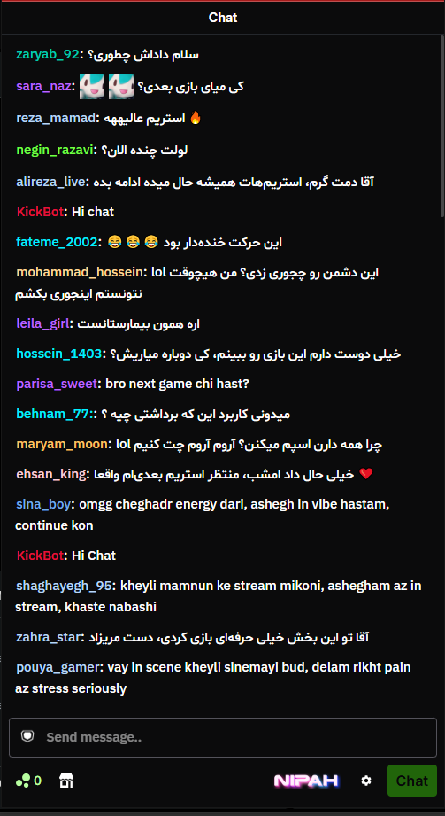
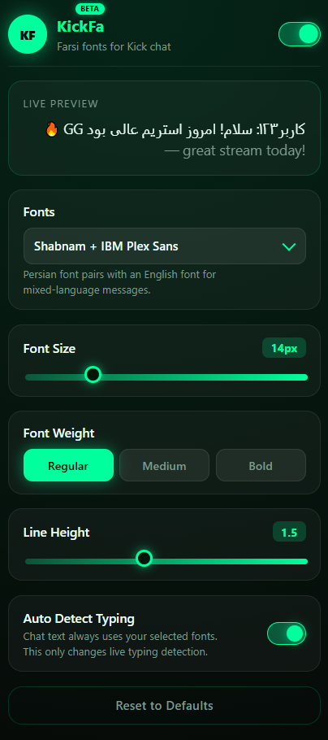

# 🚀 KickFa-extension

A browser extension that allows Kick.com users to customize their chat experience by changing chat fonts.

KickFa-extension adds support for Persian and English fonts on **Kick.com chat** and **dashboard.kick.com**, making messages easier to read and allowing users to personalize their viewing experience.

---

# 📸 Preview

Add screenshots here:

### 📸 Previews


<p align="center">
  

  
</p>

---

# ✨ Features

- 🎨 Change Kick.com chat fonts
- 🌐 Support Persian and English fonts
- ⚙️ Easy font switching through extension settings
- 📂 Custom font loading from extension files
- ⚡ Lightweight and simple design
- 💬 Works with Kick.com chat and dashboard.kick.com
- 🔄 Compatible with Kick chat customization systems


---

# 🔤 Supported Fonts

Currently supported fonts:

- Vazirmatn
- Shabnam
- IBM Plex Sans
- Inter

More fonts may be added in future updates.


---

# 📦 Requirements

Before installing KickFa-extension, make sure you have **one** of these extensions installed:

- **7TV Extension**: You can use [7TV for Chrome/Edge](https://chromewebstore.google.com/detail/7tv/ammjkodgmmoknidbanneddgankgfejfh).
- **NipahTV Extension**: You can also use [NipahTV for Chrome](https://chromewebstore.google.com/detail/nipahtv/bjggmgekoncaaalaalhchepgkjoahjln).

✨ KickFa-extension works with **both 7TV and NipahTV**.  
You can choose either one — there is no difference in functionality.

✅ Just make sure one of them is installed and enabled before using KickFa-extension on:
- kick.com
- dashboard.kick.com


## 🌐 Supported Browsers

- Google Chrome
- Microsoft Edge


---

# 📥 Installation Instructions

1. Download the latest `KickFa-extension.zip` from the [Releases](https://github.com/ASHY7z/KickFa-extension/releases) page.
2. Extract the ZIP file to a folder on your computer.
3. Follow the browser-specific instructions below.


## 🟢 For Google Chrome

1. Download the latest version of KickFa-extension.
2. Extract the downloaded ZIP file.
3. Open Chrome and go to:

```
chrome://extensions/
```

4. Enable **Developer mode** from the top right corner.
5. Click **Load unpacked**.
6. Select the extracted `KickFa-extension` folder.
7. Make sure **7TV** or **NipahTV** is installed and enabled.
8. Open Kick.com or dashboard.kick.com and refresh the page.


---

## 🔵 For Microsoft Edge

1. Download the latest version of KickFa-extension.
2. Extract the downloaded ZIP file.
3. Open Edge and go to:

```
edge://extensions/
```

4. Enable **Developer mode** from the bottom left corner.
5. Click **Load unpacked**.
6. Select the extracted `KickFa-extension` folder.
7. Confirm that **7TV** or **NipahTV** is installed and active.
8. Open Kick.com or dashboard.kick.com and refresh the page.


---

# 🛠️ How To Use

1. 🌐 Open Kick.com or dashboard.kick.com.
2. 🧩 Open the KickFa-extension settings.
3. 🔤 Select your preferred font.
4. 🔄 Refresh the Kick page if needed.

The selected font will automatically apply to Kick chat messages.


---

# 💻 Technologies Used

- JavaScript
- HTML
- CSS
- Chrome Extension API
- Web Fonts (WOFF2)


---

# 🤝 Credits

This project was created with inspiration and help from:

https://github.com/MB-PieSec/Kick-Farsi-Font-Changer

Some code ideas, structures, and implementation approaches were based on this project.

🙏 Special thanks to **MB-PieSec** for creating the original project and sharing it with the community.


---

# 🔮 Future Plans

Possible future improvements:

- 🔤 Add more fonts
- 🎨 Improve extension UI
- ⚙️ Add more customization options
- 🔄 Improve compatibility with future Kick updates


---
---
# 🚀 KickFa-extension ( فارسی )

یک افزونه مرورگر که به کاربران Kick.com اجازه می‌دهد تجربه چت خود را با تغییر فونت پیام‌ها شخصی‌سازی کنند.

KickFa-extension امکان استفاده از فونت‌های فارسی و انگلیسی را در **چت Kick.com** و **dashboard.kick.com** فراهم می‌کند تا خوانایی پیام‌ها بهتر شود و کاربران بتوانند ظاهر چت خود را شخصی‌سازی کنند.

---

# 📸 پیش‌نمایش

تصاویر را اینجا اضافه کنید:

### 💬 نمایش چت


### ⚙️ تنظیمات افزونه


---

# ✨ قابلیت‌ها

- 🎨 تغییر فونت چت Kick.com
- 🌐 پشتیبانی از فونت‌های فارسی و انگلیسی
- ⚙️ تغییر آسان فونت از طریق تنظیمات افزونه
- 📂 بارگذاری فونت‌ها از فایل‌های داخلی افزونه
- ⚡ سبک و ساده
- 💬 پشتیبانی از چت Kick.com و داشبورد Kick
- 🔄 سازگار با سیستم‌های شخصی‌سازی چت Kick


---

# 🔤 فونت‌های پشتیبانی شده

فونت‌های فعلی:

- Vazirmatn
- Shabnam
- IBM Plex Sans
- Inter

در نسخه‌های آینده ممکن است فونت‌های بیشتری اضافه شوند.


---

# 📦 پیش‌نیازها

قبل از نصب KickFa-extension، مطمئن شوید که یکی از افزونه‌های زیر را نصب کرده‌اید:

- **افزونه 7TV**: می‌توانید از [7TV برای Chrome/Edge](https://chromewebstore.google.com/detail/7tv/ammjkodgmmoknidbanneddgankgfejfh) استفاده کنید.
- **افزونه NipahTV**: همچنین می‌توانید از [NipahTV برای Chrome/Edge](https://chromewebstore.google.com/detail/nipahtv/bjggmgekoncaaalaalhchepgkjoahjln) استفاده کنید.

✨ KickFa-extension با **هر دو افزونه 7TV و NipahTV** کار می‌کند.

می‌توانید فقط یکی از آن‌ها را انتخاب کنید — از نظر عملکرد تفاوتی ندارند.

✅ فقط مطمئن شوید یکی از این افزونه‌ها نصب و فعال باشد تا KickFa-extension روی موارد زیر کار کند:

- kick.com
- dashboard.kick.com


## 🌐 مرورگرهای پشتیبانی شده

- Google Chrome
- Microsoft Edge


---

# 📥 راهنمای نصب

1. فایل `KickFa-extension.zip` را از صفحه [Releases](https://github.com/ASHY7z/KickFa-extension/releases) دانلود کنید.
2. فایل ZIP را Extract کنید.
3. دستورالعمل‌های مربوط به مرورگر خود را دنبال کنید.

## 🟢 نصب در Google Chrome

1. آخرین نسخه KickFa-extension را دانلود کنید.
2. فایل ZIP دانلود شده را Extract کنید.
3. در مرورگر Chrome وارد آدرس زیر شوید:

```
chrome://extensions/
```

4. گزینه **Developer mode** را از بالا سمت راست فعال کنید.
5. روی **Load unpacked** کلیک کنید.
6. پوشه استخراج شده `KickFa-extension` را انتخاب کنید.
7. مطمئن شوید **7TV** یا **NipahTV** نصب و فعال است.
8. وارد Kick.com یا dashboard.kick.com شوید و صفحه را Refresh کنید.


---

## 🔵 نصب در Microsoft Edge

1. آخرین نسخه KickFa-extension را دانلود کنید.
2. فایل ZIP را Extract کنید.
3. در Edge وارد آدرس زیر شوید:

```
edge://extensions/
```

4. گزینه **Developer mode** را از پایین سمت چپ فعال کنید.
5. روی **Load unpacked** کلیک کنید.
6. پوشه استخراج شده `KickFa-extension` را انتخاب کنید.
7. مطمئن شوید **7TV** یا **NipahTV** نصب و فعال است.
8. وارد Kick.com یا dashboard.kick.com شوید و صفحه را Refresh کنید.


---


# 🛠️ نحوه استفاده

1. 🌐 وارد Kick.com یا dashboard.kick.com شوید.
2. 🧩 تنظیمات KickFa-extension را باز کنید.
3. 🔤 فونت مورد نظر خود را انتخاب کنید.
4. 🔄 در صورت نیاز صفحه Kick را Refresh کنید.

فونت انتخاب شده به صورت خودکار روی پیام‌های چت Kick اعمال خواهد شد.


---

# 💻 تکنولوژی‌های استفاده شده

- JavaScript
- HTML
- CSS
- Chrome Extension API
- Web Fonts (WOFF2)


---

# 🤝 تشکر و منابع

این پروژه با الهام و کمک از پروژه زیر ساخته شده است:

https://github.com/MB-PieSec/Kick-Farsi-Font-Changer

بخشی از ایده‌ها، ساختار کد و روش‌های پیاده‌سازی با الهام از این پروژه استفاده شده است.

🙏 تشکر ویژه از **MB-PieSec** برای ساخت پروژه اصلی و به اشتراک گذاشتن آن.


---

# 🔮 برنامه‌های آینده

امکاناتی که ممکن است در آینده اضافه شوند:

- 🔤 اضافه کردن فونت‌های بیشتر
- 🎨 بهبود رابط کاربری افزونه
- ⚙️ اضافه کردن گزینه‌های شخصی‌سازی بیشتر
- 🔄 بهبود سازگاری با بروزرسانی‌های آینده Kick


---

Made with ❤️ by ASHY7z
